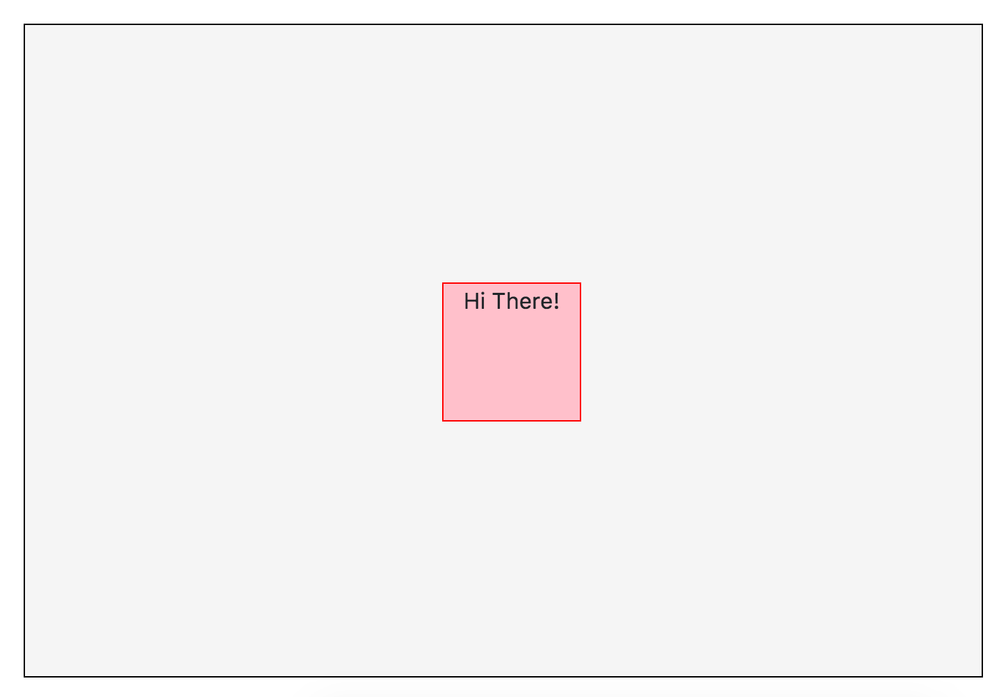
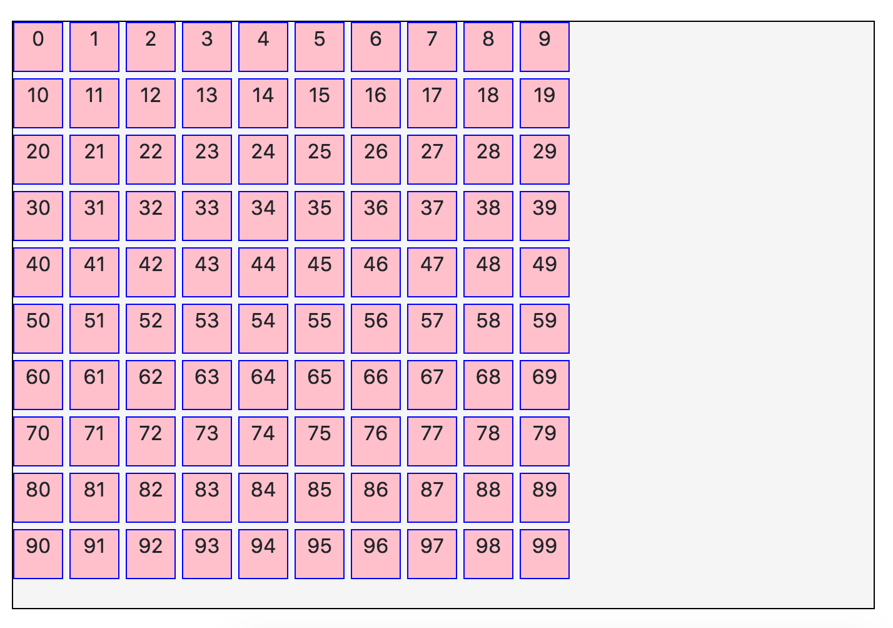
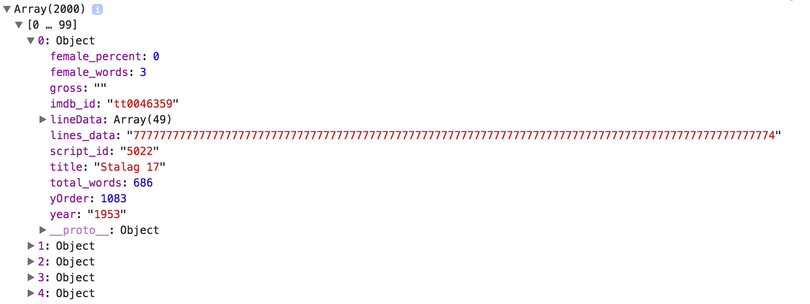
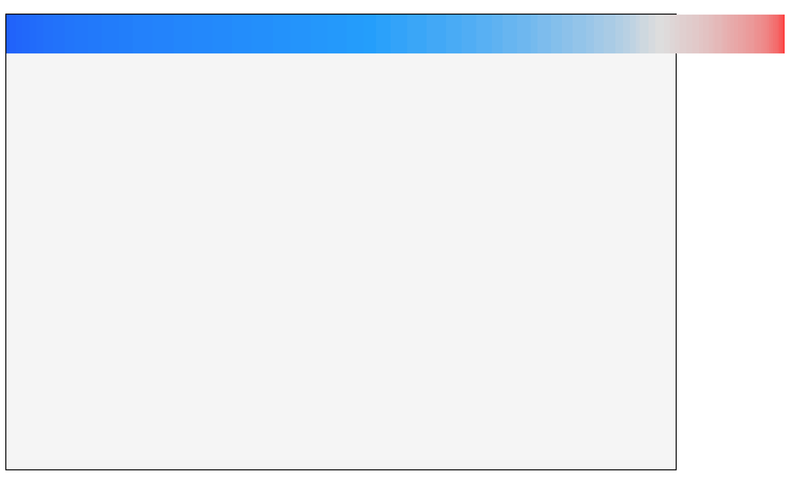
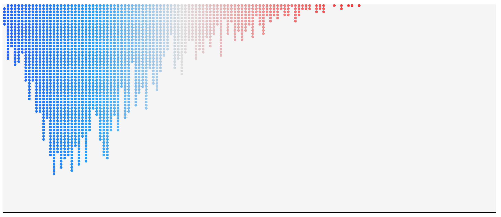
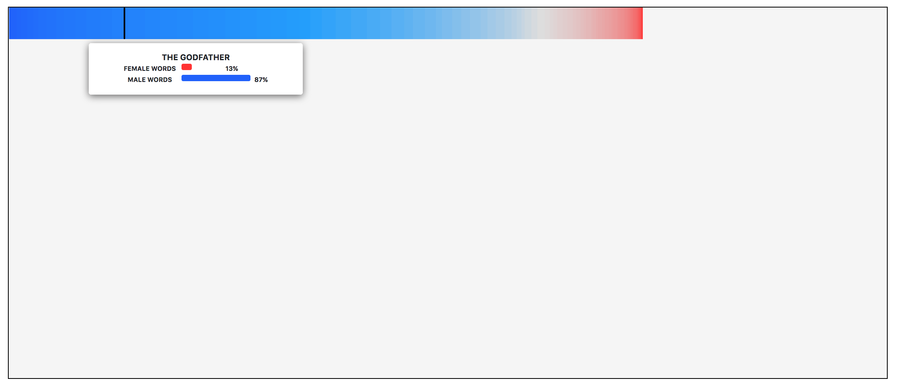

# Data Visualisations with d3.js

This Dojo is based on the article [The Largest Ever Analysis of Film Dialogue by Gender](https://pudding.cool/2017/03/film-dialogue/)

### Part 1: Draw a square
[Useful Docs](https://d3js.org/#selections)

[Solution](https://bl.ocks.org/hanahanderson/c77e430d40d5cccdb484d6eb1771953c)

___
### Part 2: Draw squares from data
[Useful Docs](https://d3js.org/#enter-exit)

[Solution](https://bl.ocks.org/hanahanderson/37bc7965987016c7e8bdb09b36455d5c)

___
### Part 3: Load data from remote source
[Useful Docs](https://github.com/d3/d3-request/blob/master/README.md#csv)

The data used for this visualisation is [here](https://raw.githubusercontent.com/matthewfdaniels/scripts/graphs/meta_data7.csv).

[Solution](https://bl.ocks.org/hanahanderson/13a3613383a8369ed3765d6202e715ac)

___
### Part 4: Draw squares from loaded data

[Solution](https://bl.ocks.org/hanahanderson/09f97bc936db2e370c6c18776c0c4b0a)

___
### Part 5: Trigger an animation
[Useful Docs](https://d3js.org/#transitions)

[Solution](https://bl.ocks.org/hanahanderson/b912694acb71b6aed3b1396fbfc0dc7f)

___
### Part 6: Interacting with the Visualisation

[Solution](https://bl.ocks.org/hanahanderson/08b0e3ec69344584c58a166556cbfa2c)
